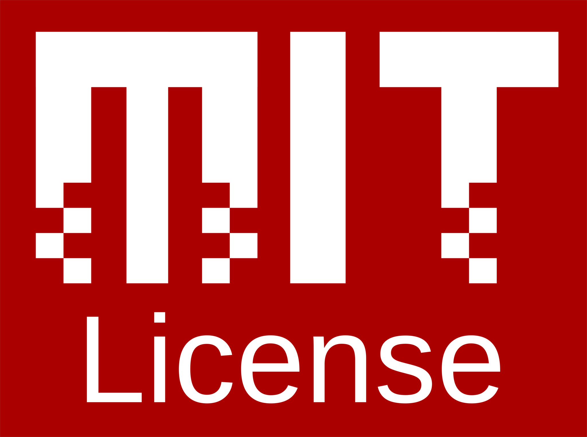

# @onegen/optional

> [!WARNING]  
> 🚧 Very much work-in-progress! 🚧

`Optional` utility class in TypeScript, based on C++
[`std::optional`](https://en.cppreference.com/w/cpp/utility/optional).

Made as minimally as I could, without any dependencies.

<!--
## Compatibility

| **Runtime** | **Package** |
| ----------- | ----------- |
| Node.JS     | [NPM](#)    |
| Web         | not yet     |
| Deno        | [JSR](#)    |
| Bun         | not yet     | 
-->

## TODO

- [X] Internal value holder, `value()`, `hasValue()`, `some` & `none`
- [X] Method `valueOr()` & tests `optional-base.test.ts`
- [X] Method `reset()`
- [X] Method `swap()`
- [ ] Method `emplace()` (necessary?)
- [ ] Tests `optional-mod.test.ts` (reset, swap, emplace)
- [ ] Method `transform()`
- [ ] Method `andThen()`
- [ ] Method `orElse()`
- [ ] Tests `optional-mon.test.ts` (transform, andThen, orElse)
- [ ] NPM package 0.?
- [ ] Tests from cppreference examples
- [ ] NPM package 1.0
- [ ] Deno script for extensions + JSR package 1.0

## Licence

**@onegen/optional** is available as an open-source utility library licenced
under the [MIT Licence](https://en.wikipedia.org/wiki/MIT_License).

- TL;DR;NAL:
   Do absolutely whatever you want with the code, just include
   the LICENCE file if you re-distribute it.
- See [`LICENCE`](LICENCE) file or
   [tl;drLegal](https://www.tldrlegal.com/license/mit-license)
   for more details.
